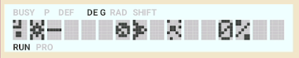

[ [Engligh](README.md) | [日本語](README_ja.md) ]

---

# PC1245-EARTH DEFENDER



某誌風ドキュメントは[こちら](./doc/pc1245-earthdefender.pdf)

<br>

## 概要

1983年に日本のシャープから発売された、ポケットコンピュータ"PC-1245"のプログラムです。<br>
BASICとマシン語で構成されています。<br>

<br>

## 実行方法

マシン語プログラムは、以下コマンドでロードしてください。<br>

```
CLOADM &C500
```

<br>

BASICプログラムは、以下コマンドでロードしてください。<br>

```
CLOAD
```

<br>

ロードが終わったら、[DEF]+[A]でスタートします。

<br>

## 遊び方

- 画面中心の地球を狙って、左右から敵が襲ってきます。
- 地球防衛衛星を左右に操作して、ビームを撃って敵を撃破してください。
- 敵もビームで攻撃してきます。このときは、バリアで防御してください。ただし、バリアを張っている時はビームは撃てません。
- 敵が地球に到達するか、ビームの攻撃を受けると、ダメージが増えます。
- ダメージが100%になると、ゲームオーバーです。

<br>

## 操作方法

- [4][6] : 地球防衛衛星を左右に移動
- [2] : ビームを撃つ
- [8] : バリアを張る/解除
 
<br>

## PokecomGoでプレイする

スマートフォンに以下に2ファイルを転送し、アプリでロードしてください。

```
/src/earthdefender.bas
/dist/earthdefender-C500.bin
```

<br>

## 作者

Hitoshi Iwai (aburi6800)

<br>

## 更新履歴

2026/10/04 ver1.00
- 初期リリース

2026/10/05 ver1.10
- 画面表示周りを修正

2026/10/05 ver1.11
- バグフィックス

<br>

## ライセンス

MIT Licence

<br>

## 謝辞

- [SC61860 Asembler YASM61860](https://www.oit.ac.jp/labs/rd/rssrv/kobayashi-lab/~yagshi/old_web/misc/pocketcom/yasm.html)
- [Pocket Tools](http://pocket.free.fr/html/soft/pocket-tools_e.html)
- [Pokecom Go](https://digihori.jimdofree.com/index/emulator/)
- [Genymotion](https://www.genymotion.com/)
